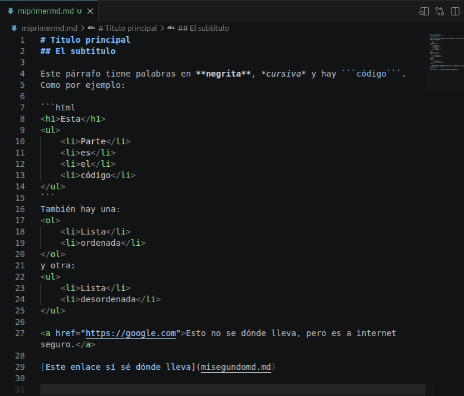

# Título principal
## El subtítulo

Este párrafo tiene palabras en **negrita**, *cursiva* y hay ```código```.
Como por ejemplo:

```html
<h1>Esta</h1>
<ul>
    <li>Parte</li>
    <li>es</li>
    <li>el</li>
    <li>código</li>
</ul>
```
También hay una:
<ol>
    <li>Lista</li>
    <li>ordenada</li>
</ol>
y otra:
<ul>
    <li>Lista</li>
    <li>desordenada</li>
</ul>

<a href="https://google.com">Esto no se dónde lleva, pero es a internet seguro.</a>

[Este enlace sí sé dónde lleva](misegundomd.md)



> Y por último tenemos la tabla:

|C1|C2|C3|C4|
|---|---|---|---|
|L1|L2|L3|L4|
|L1|L2|L3|L4|
|L1|L2|L3|L4|
|L1|L2|L3|L4|